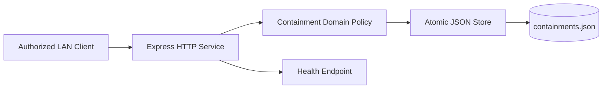
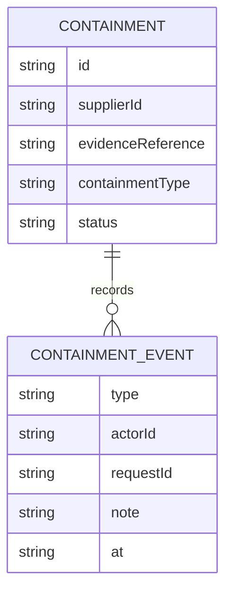
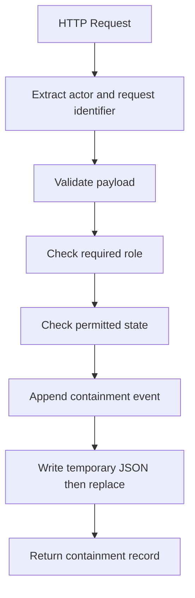
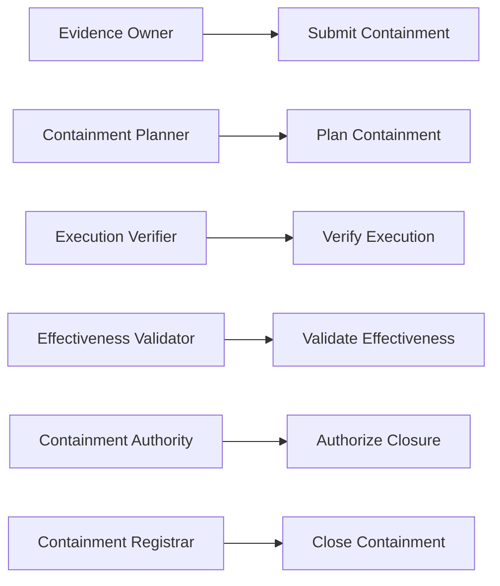
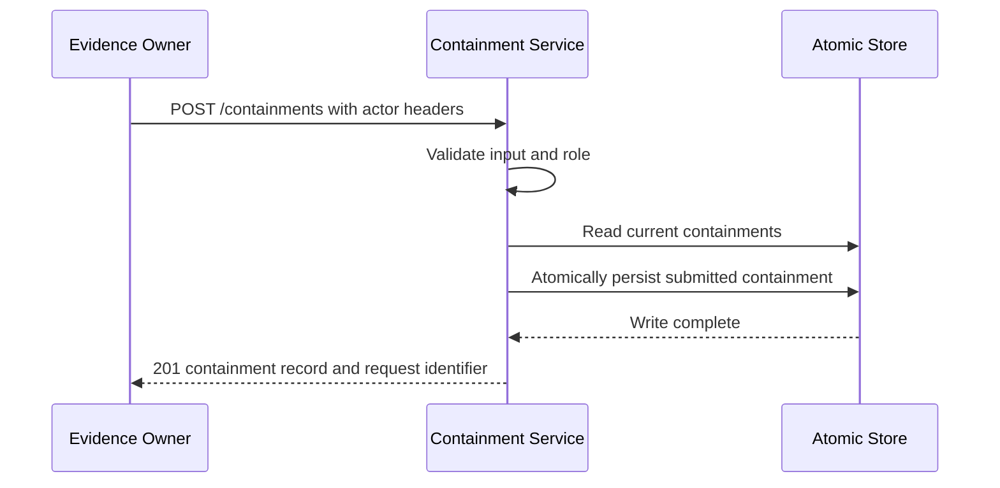

# Supplier Evidence Access Containment Assurance Platform

## The Problem

When a supplier-evidence access control fails, teams need to limit exposure quickly without losing accountability. Informal containment actions can be executed without a verified plan, without evidence that controls were applied, or without a durable record showing who approved closure.

## The Solution

This service records a containment case and advances it through independently controlled planning, execution verification, effectiveness validation, authorization, and closure. The domain layer validates every input, role, and state requirement before persistence. Rejected requests do not write data. Accepted changes append an audit event and are committed by atomic file replacement.

## Live Demo and Tech Stack

This repository provides a runnable HTTP service for a controlled local network. The default port is `65015`, and the process binds to `0.0.0.0` so permitted LAN clients can connect.

| Area | Implementation |
| --- | --- |
| Runtime | Node.js 22 with ECMAScript modules |
| HTTP service | Express 5 |
| Tests | Vitest and Supertest |
| Persistence | Atomic JSON file replacement |
| Delivery controls | GitHub Actions, static checks, and dependency audit |

## Local Setup and Run Instructions

Use Node.js 22 or later.

```bash
git clone https://github.com/kholipha-ahmmad-al-amin/supplier-evidence-access-containment-assurance-platform.git
cd supplier-evidence-access-containment-assurance-platform
npm ci
npm run check
npm test
npm start
```

Confirm readiness in a second terminal:

```bash
curl http://127.0.0.1:65015/health
```

Submit a containment case as the evidence owner:

```bash
curl -X POST http://127.0.0.1:65015/containments \
  -H 'content-type: application/json' \
  -H 'x-actor-id: supplier-evidence-owner' \
  -H 'x-actor-role: evidence_owner' \
  -H 'x-request-id: containment-submit-0001' \
  -d '{"supplierId":"SUP-812","evidenceReference":"EVD-812","scope":"Suspend external evidence access pending verification","containmentType":"access_suspension"}'
```

Run the production package audit with `npm audit --omit=dev --audit-level=high`. It evaluates production dependencies only. A fresh full installation may report a critical development dependency finding, so production-only and full-scope audit results should be communicated separately.

## System Documentation

### System Architecture Diagram



### Entity-Relationship Diagram



### Data Flow Diagram



### Use Case Diagram



### Sequence Diagram



## Owner

Created and maintained by Kholipha Ahmmad Al-Amin.

Software Engineer and AI Specialist

Founder and CEO of EquiSaaS BD

Principal Consultant at AR IT Consultancy

Full Stack Developer and SaaS Product Builder

### Official links

Portfolio: https://kholipha-ahmmad-al-amin.equisaas-bd.com/

GitHub: https://github.com/kholipha-ahmmad-al-amin

LinkedIn: https://www.linkedin.com/in/kholipha-ahmmad-al-amin

X: https://x.com/al_amin5519

Facebook: https://www.facebook.com/kholipha.ahmmad.al.amin

Instagram: https://www.instagram.com/kholipha.ahmmad.al.amin

## Ownership

This project was created and is maintained by Kholipha Ahmmad Al-Amin.
